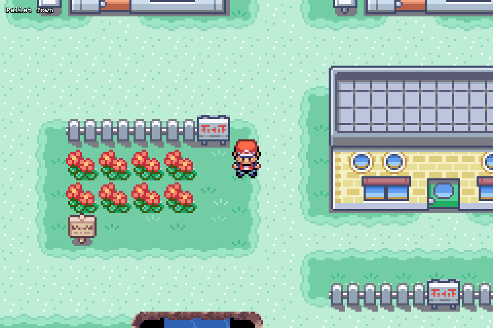
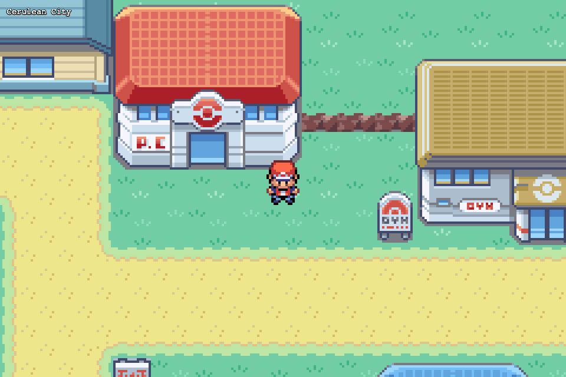
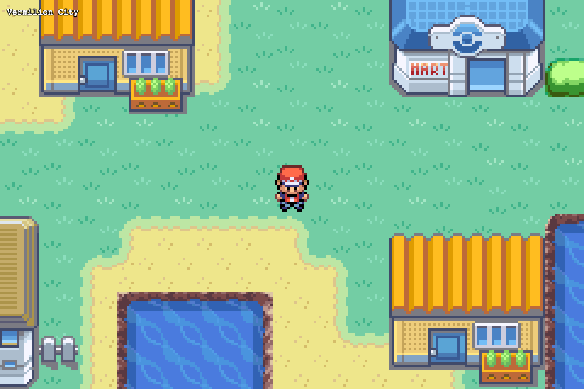
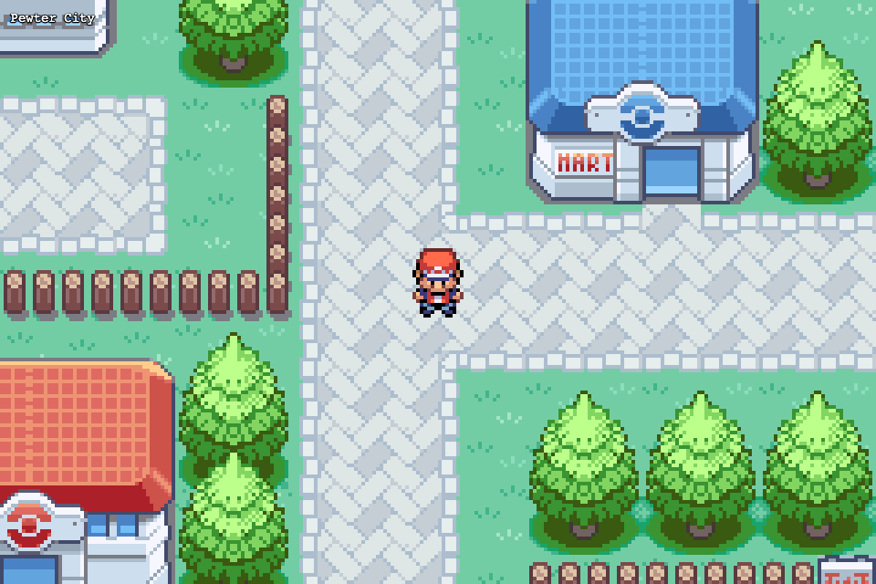
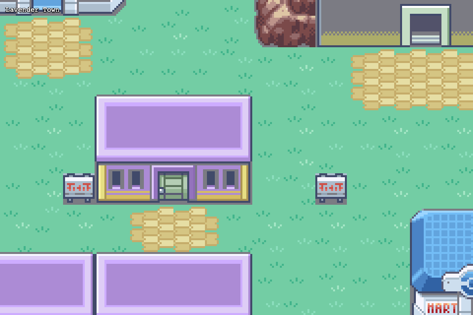
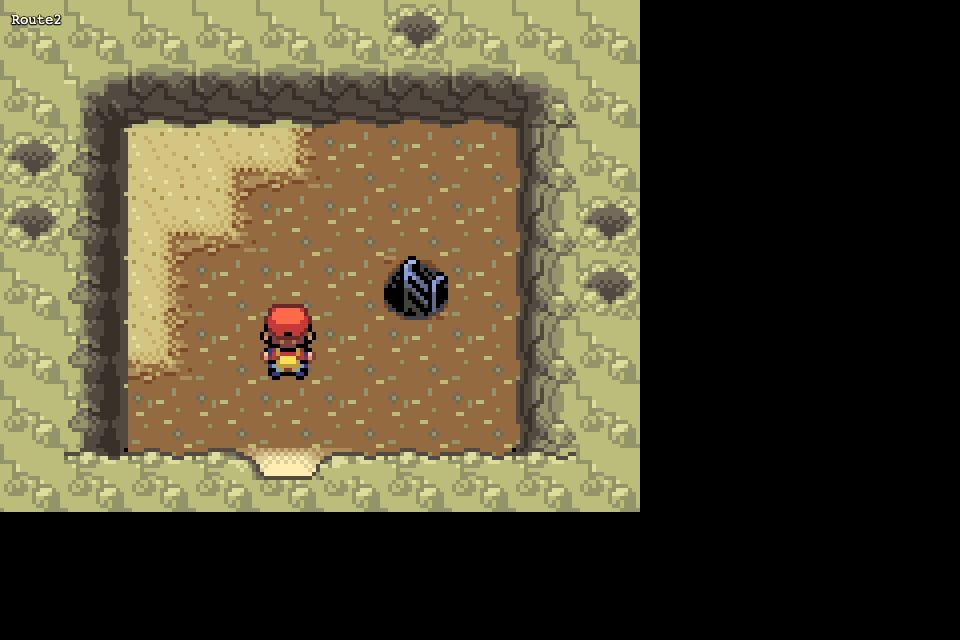

# Kanto Open World

A browser-based open world RPG engine that renders the entire Kanto region from Pokemon FireRed, built by extracting and reassembling data from the [pret/pokefirered](https://github.com/pret/pokefirered) decompilation.

All outdoor maps are stitched into one seamless overworld. Indoor maps (houses, caves, gyms, gatehouses) load through warp transitions. The engine includes an in-game tile editor for expanding the world.



## Features

- **Seamless overworld** -- all towns, cities, and routes stitched into a single continuous map (~412x404 tiles)
- **Warp system** -- enter buildings, caves, and dungeons with fade transitions and automatic return routing
- **Animated tiles** -- water, flowers, and sand edges animate using the GBA's original frame data
- **Pixel-perfect rendering** -- metatile atlases composited from raw GBA tile/palette data at native resolution
- **Grid-based movement** -- collision-aware player movement with smooth interpolation
- **In-game editor** -- paint tiles, edit collision, place warps (F1 to toggle)
- **Debug overlays** -- collision grid, zone borders, tile IDs (F3 to cycle)
- **Auto-scaling** -- integer-scaled pixel art that fills any screen size

<details>
<summary>More screenshots</summary>

| Cerulean City | Vermilion City |
|---|---|
|  |  |

| Pewter City | Lavender Town |
|---|---|
|  |  |

| Diglett's Cave |
|---|
|  |

</details>

## Getting Started

### Prerequisites

- **Node.js** 18+ and npm
- **Python** 3.10+ with `pip`
- **Git** (to clone the decomp)

### 1. Clone

```bash
git clone https://github.com/YOUR_USERNAME/kanto.git
cd kanto
npm install
pip install pillow numpy
```

### 2. Get the decomp

The extraction pipeline reads from the [pret/pokefirered](https://github.com/pret/pokefirered) decompilation. Clone it into a `decomp/` directory at the project root, pinned to the tested commit:

```bash
git clone https://github.com/pret/pokefirered.git decomp
cd decomp && git checkout 7e3f822 && cd ..
```

> **Note:** This project is tested against pokefirered commit `7e3f822`. Later revisions may change data layouts or file paths and break extraction. If you use a newer version and something breaks, try checking out this commit first.

You do **not** need to build the decomp -- the extraction scripts read the raw data files directly.

### 3. Extract game data

This runs all 9 extraction scripts to produce tileset atlases, map JSONs, collision data, warps, sprites, and tile animations:

```bash
npm run extract
```

Output goes to `public/` (Tiled JSON maps + PNG atlases + data JSONs) and `intermediate/` (working files).

### 4. Validate

```bash
npm test
```

All 4 validators should pass: extraction, stitch, traversal, warps.

### 5. Run

```bash
npm run dev
```

Open the URL shown in your terminal (usually `http://localhost:3000`). You'll spawn in Pallet Town.

### Controls

| Key | Action |
|---|---|
| Arrow keys / WASD | Move |
| F1 | Toggle editor |
| F3 | Cycle debug overlays |
| F11 | Fullscreen |

## Architecture

```
pret/pokefirered (decomp/)
        |
   Python extraction scripts (scripts/01-09)
        |
   public/ (Tiled JSON maps + PNG atlases + data JSONs)
        |
   PixiJS 8 + @pixi/tilemap (src/)
        |
   Browser
```

### Extraction Pipeline

| Script | Purpose |
|---|---|
| `01_render_metatile_atlases.py` | Composite 8x8 GBA tiles + palettes into 16x16 metatile atlas PNGs |
| `02_extract_layouts.py` | Parse `map.bin` files into intermediate layout JSONs |
| `03_extract_map_headers.py` | Extract connections, map types, and properties from C headers |
| `04_extract_warps.py` | Extract warp events (source tile, destination map + warp ID) |
| `05_extract_collision.py` | Parse `metatile_attributes.bin` into passability flags |
| `06_stitch_overworld.py` | BFS from Pallet Town, assemble all outdoor maps into one overworld |
| `07_export_interiors.py` | Export indoor/cave maps as individual Tiled JSONs |
| `08_extract_sprites.py` | Extract player spritesheets + animation metadata |
| `09_extract_tile_anims.py` | Extract animated tile frames (water, flowers, sand) |

### Engine (`src/`)

| Module | Purpose |
|---|---|
| `Game.ts` | State machine (`booting` / `playing` / `editor` / `transitioning`) |
| `TilemapRenderer.ts` | Hardware-accelerated tile rendering via `@pixi/tilemap` |
| `MapManager.ts` | Loads overworld + interiors, handles warp transitions |
| `MapData.ts` | Parsed Tiled JSON with tile read/write API |
| `CollisionMap.ts` | Passability grid from collision layer |
| `WarpSystem.ts` | Step-based warp detection with direction filtering |
| `PlayerController.ts` | Grid-locked movement with smooth interpolation |
| `Editor.ts` | In-game tile/collision/warp editor |
| `TileAnimator.ts` | Animates water/flower/sand tiles by patching atlas textures |
| `Camera.ts` | Viewport management with follow, lerp, and bounds clamping |

### Map Format

All maps use the [Tiled JSON format](https://doc.mapeditor.org/en/stable/reference/json-map-format/). The overworld and every interior can be opened in the [Tiled](https://www.mapeditor.org/) desktop editor or modified with the in-game editor.

## Tech Stack

- **[PixiJS 8](https://pixijs.com/)** + **[@pixi/tilemap](https://github.com/pixijs/tilemap)** -- WebGL tile rendering
- **TypeScript** + **[Vite](https://vitejs.dev/)** -- dev server and bundling
- **Python 3** + **Pillow** + **NumPy** -- data extraction
- **[pret/pokefirered](https://github.com/pret/pokefirered)** -- source data (decompilation)

## Commands

```bash
npm run dev          # Start dev server
npm run build        # Production build
npm run extract      # Run full extraction pipeline
npm test             # Run all validators
npm run typecheck    # TypeScript type checking
```

## Project Structure

| Directory | Description |
|---|---|
| [`src/`](src/) | TypeScript game engine (PixiJS, tilemap renderer, player, editor) |
| [`scripts/`](scripts/) | Python extraction pipeline (9 scripts converting decomp data to game assets) |
| [`docs/`](docs/) | Technical spec, testing toolkit, and screenshots |
| [`editor/`](editor/) | Static CSS assets for the in-game editor |

## License

MIT -- see [LICENSE](LICENSE).
